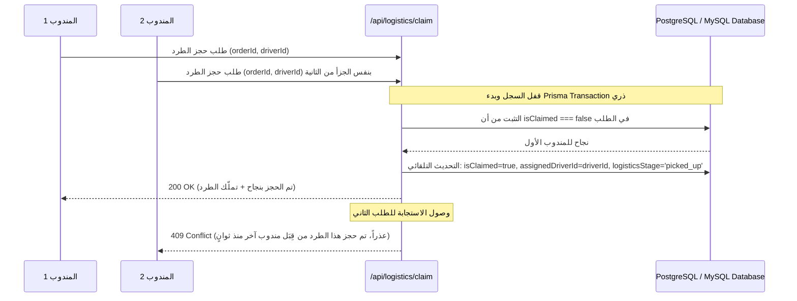

# الشامل في هندسة وتفاصيل نظام اللوجستيات الذكي (ChariDay Smart Logistics Engine)

مرحباً بك في الوثيقة الفنية التفصيلية لنظام اللوجستيات الخاص بمنصة ChariDay. تم تصميم هذا النظام بناءً على أفضل المعايير المعمارية والبرمجية المستلهمة من أنظمة عالمية (مثل **FleetOps** لإدارة الأسطول والمراحل التشغيلية، و **LastMile** لخوارزميات تطبيع التتبع ورسم خرائط التوزيع اللحظي)، ليخدم التجار المعتمدين، شركات الشحن الخارجية والداخلية، ومندوبي التوصيل المستقلين.

---

## 🏗️ 1. الهندسة المعمارية والفلسفة الأساسية (Universal-First Architecture)

تعتمد المنصة على مبدأ **"نظام الحالات الموحد (Universal Status Layer)"** الموجه عالميًا:
> **القاعدة السلمية:** المنصة لا تتكلم بلغة شركة شحن معينة (مثل أكواد Yalidine أو Aramex)، بل كل شركة شحن تتكيف مع النظام القياسي لـ ChariDay من خلال طبقة تحويل مركزية (Adapter Pattern).

تم إنجاز هذه الطبقة في الملف المرجعي: `src/lib/logistics/carrier-status-map.ts`. 

### لماذا هذا المنهج؟
- **فصل الاهتمامات (Separation of Concerns):** لا داعي لكتابة منطق معقد أو استثناءات شرطية (if/else) داخل مكونات واجهة المستخدم أو خوارزمية الخريطة لكل شركة شحن.
- **القابلية العالية للتوسع (Scalability):** دمج شركة شحن دولية جديدة (DHL, FedEx, Aramex) أو محلية (Maystro, ZR Express, Yalidine) يتم عبر إضافة قاموس تحويل بسيط مكون من بضعة أسطر دون مساس بجسم النظام.
- **تعدد اللغات الكامل (Trilingual Localization):** كل حالة محوّلة تمتلك تمثيلاً دلاليًا ثلاثيًا في النظام الداخلي والترجمات واجهات الخدمة باللغات: العربية، الإنجليزية، والفرنسية.

---

## 🌐 2. جدول حالات النظام الموحد والترجمات الكاملة

يحتوي النظام الموحد لـ ChariDay على **9 حالات قياسية (Universal Statuses)** تُعرّف دورة حياة الطرد بدقة:

| الرمز الداخلي (Key) | العربية (AR) 🇩🇿 | الإنجليزية (EN) 🇬🇧 | الفرنسية (FR) 🇫🇷 | اللون (UI) | التصنيف والظهور في الخريطة |
|---|---|---|---|---|---|
| `pending` | في الانتظار | Pending | En attente | 🟡 #f59e0b | قائمة الرفع التمهيدية / لا يظهر نشطاً على الخريطة |
| `ready` / `ready_for_pickup` | جاهز للاستلام | Ready for Pickup | Prêt pour ramassage | 🔵 #3b82f6 | **🟢 نشط (Active) - متاح في سوق الشحن المفتوح** |
| `picked_up` | تم الاستلام | Picked Up | Ramassé | 🟣 #8b5cf6 | **🟢 نشط (Active) - محجوز لمندوب / في الهيكل** |
| `in_transit` | في الطريق | In Transit | En transit | Indigo #6366f1 | **🟢 نشط (Active) - مؤشر نابض على الخريطة** |
| `out_for_delivery` | خرج للتوصيل | Out for Delivery | En cours de livraison | 🌐 Sky #0ea5e9 | **🟢 نشط (Active) - في مرحلة التوصيل النهائي** |
| `delivered` | تم التوصيل | Delivered | Livré | 🟢 #10b981 | 🏁 **حالة منتهية (Terminal) - يُزال فوراً من الخريطة** |
| `failed` | محاولة فاشلة | Delivery Failed | Échec de livraison | 🟠 #f97316 | ⚠️ حالة معلقة يحتاج العميل إما لإعادة التوجيه أو الإلغاء |
| `returned` | مُعاد للتاجر | Returned | Retourné au vendeur | slate #64748b | 🏁 **حالة منتهية (Terminal) - يُزال من خريطة المناديب** |
| `cancelled` | ملغي | Cancelled | Annulé | 🔴 #ef4444 | 🏁 **حالة منتهية (Terminal) - يُزال فوراً من الخريطة** |

---

## 🚀 3. مسارات المعالجة واختيار أسلوب الشحن (Fulfillment Workflows)

عندما يؤكد التاجر الطلب من شاشة إدارة الطلبات (`StoreOrdersPage.tsx` أو لوحة التاجر)، يُخيَّر بين مسارين تشغيلين يُحفظان في الحقل `fulfillmentType`:

### المسار الأول: التغليف والتجهيز عبر التاجر (`fulfillmentType: 'merchant'`)
1. التاجر يقوم بتجهيز وتغليف المنتج داخل مخزنه الخاص.
2. عند التجهيز النهائي، يضغط على زر **"طرح في سوق الشحن (Ready for Pickup)"**.
3. ينتقل الطلب إلى مرحلة `logisticsStage: 'ready_for_pickup'`، ويتم طرح الطرد تلقائيًا في **سوق الشحنات المفتوح (Open Load Pool)**.
4. يظهر الطرد للمندوبين المستقلين وشركات الشحن على حد سواء لتقديم طلب اقتناص وحجز ذري.

### المسار الثاني: التغليف والتوزيع عبر شركة شحن خارجية / مستودع 3PL (`fulfillmentType: 'carrier'`)
1. التاجر يوجه الطلب مباشرة بعد التأكيد لشركة الشحن المتعاقد معها (يُحاط بـ `assignedCarrierId`).
2. يتحول الطلب إلى مرحلة `logisticsStage: 'ready_for_carrier'`.
3. يظهر الطلب حصريًا في **صندوق وارد شركة الشحن (`/api/logistics/carrier/inbox`)**، لتقوم الشركة باستلام البضاعة من التاجر، توليد الباركود والوزن، وتأكيد التغليف لديها.
4. عندما تقوم شركة الشحن بتأكيد التغليف، تُحدث المرحلة إلى `ready_for_pickup` ليُنشر الطرد لمندوبي السعاة التابعين لتلك الشركة أو عبر أسطول التوصيل.

---

## 🔒 4. آلية الحجز والقفل الذري (Atomic Claim Lock Algorithm)

لمنع التعارض والازדماج عندما يحاول مندوبان حجز أو اقتناص نفس الشحنة المتاحة في نفس اللحظة من **سوق الشحن (Open Load Pool)**، يعتمد النظام على عملية قفل بقيمة واحدة باستخدام `Prisma $transaction`.



### خط سير الخارطة داخل الـ Transaction:
- **الخطوة 1:** التحقق التام من حالة الشحنة والطلب داخل قفل العملية البرمجي.
- **الخطوة 2:** إن كان الطرد محجوزاً (أو المعرف `assignedDriverId` معبأ)، يتم إسقاط الاستدعاء فوراً برمز حالة HTTP `409 Conflict` دون التأثير على تدرج قاعدة البيانات.
- **الخطوة 3:** إتمام الربط بتسجيل timestamp الحجز (`claimedAt`) وتحديث حالة التوصيل الفعالة.

---

## 🗺️ 5. الخريطة اللحظية الذكية (Live Tracking Engine & Map Filtering)

الخريطة التفاعلية للمناديب وأصحاب القرار (`LiveTrackingMap.tsx` و `LogisticsDashboard.tsx`) مصممة ومحترمة لقواعد العرض الصارمة:
1. **فلترة الطرود الفعالة فقط:** لا تقوم الواجهة بجلب الطلبات الملغاة أو التي تم تسليمها بنجاح منذ أيام، وذلك بفضل استشارة المصفوفة الثابتة `ACTIVE_MAP_STATUSES`.
2. **تمثيل الألوان والحالات برمجياً:**
   - الطرود الجاهزة لتقديم العطاء (`ready`) تظهر بدبابيس زرقاء مخصصة.
   - الطرود المقبولة والتي تسير في خط الشحنات (`in_transit`, `out_for_delivery`) تظهر بألوان نيزكية مع وميض بصري (Pulse Animation).
3. **أرشفة تاريخ التوصيل التراكمي:** توفّر الخريطة للمندوب زراً للتبديل بين الطرود النشطة في الطريق، والطلبات التامة التي جرت في نفس היום لأغراض المتابعة المالية واحتساب الأجور وحجم المحفظة اليومي (KPIs).

---

## 🛠️ 6. دليل إضافة شركة شحن جديدة في المستقبل

لإضافة أسطول شحن محلي أو دولي جديد، كل ما على مهندسي ومطوري المنصة فعله هو:
1. فتح ملف التحويل المركزي: `src/lib/logistics/carrier-status-map.ts`.
2. إضافة المفتاح والقاموس الخاص بحالات الـ API الخاصة بالشركة داخل كائن `CARRIER_STATUS_MAPS`:
```typescript
export const CARRIER_STATUS_MAPS: Record<string, Record<string, UniversalStatus>> = {
  // ...
  new_carrier_name: {
    'RAW_STATUS_FROM_THEIR_API': 'pending',
    'SHIPPED': 'in_transit',
    'HANDED_OVER': 'out_for_delivery',
    'SUCCESS_DONE': 'delivered',
    'CANCELED_ORDER': 'cancelled',
  },
};
```
3. ستقوم بقية خوارزميات المنصة، من لوحة التحفيز للخريطة، مروراً بنظام الحسابات المالية (COD Verification والـ PIN)، وبالترجمات الدقيقة في كل الشاشات بتمثيل الشحنات بشكل متوافق ومثالي 100%.
